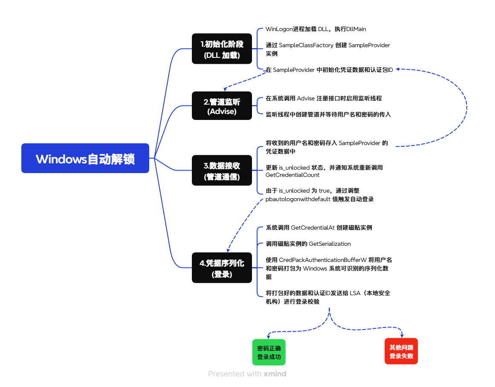

# Rust Windows 自动解锁核心DLL

因发现市面上有人在盗卖本项目，更有甚者改个软件名字，就当成自己软件在卖，多次举报无果。所以从2026年3月1日开始，本项目闭源。

如果你对程序某一块功能感兴趣，可以提交 issues，我看到后会给你提供一些支持。

## 功能特性

* **Rust 原生实现**：利用 `windows-rs` 库直接调用 Win32 API，保证内存安全与高性能。
* **命名管道监听**：后台线程监听自定义管道，支持非接触式凭据注入。
* **自动登录触发**：接收到凭据后自动调用 `CredentialsChanged` 触发系统登录流程。

## 核心架构

该项目由四个核心部分组成：

1. **`lib.rs`**: COM DLL 出口，管理注册与引用计数。
2. **`CSampleProvider`**: 实现了 `ICredentialProvider`，负责管理磁贴（Tile）的生命周期。
3. **`CSampleCredential`**: 实现了 `ICredentialProviderCredential`，负责将明文密码打包为系统序列化缓冲区。
4. **`CPipeListener`**: 独立的后台监听线程，负责管道通信。

## 实现流程

## 安装与编译

### 前置条件

1. **Rust**: 1.90.0 (1159e78c4 2025-09-14) (包含 `cargo` 工具链)
2. **Visual Studio**: 包含 C++ 桌面开发组件 (用于编译 DLL)

### 安装与运行

**本项目的核心代码已闭源，无法编译运行。**

## ⚠️ 安全警告

本项目仅用于**学习与研究** Windows 认证机制。在生产环境部署前，请务必注意：

* **明文传输风险**：当前管道通信未加密，本地恶意软件可能嗅探到传输的密码。
* **凭据存储**：本程序在内存中短暂持有明文凭据，请确保内存清理逻辑严密。

## ⚠️ 免责声明

本项目涉及修改 Windows 系统注册表及 `C:\Windows\System32` 目录。在使用或二次开发时，请务必了解以下风险：

* 错误修改注册表可能导致系统无法正常登录。
* 建议在虚拟机 (VMware/Hyper-V) 环境中进行调试。
* 作者不对因使用本软件导致的任何数据丢失或系统崩溃负责。